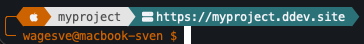
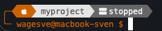

# DDEV Status Segment for Oh My Posh

Display [DDEV](https://ddev.com/) project status directly in your [Oh My Posh](https://ohmyposh.dev/) prompt — including server status and project URL.

**Running** — teal background with project URL:



**Stopped** — gray background with status:



## Features

- 🟢 **Running** — teal background, shows project URL (`https://project.ddev.site`)
- 🟡 **Paused** — amber background, shows "paused"
- ⚫ **Stopped** — gray background, shows "stopped"
- 🔲 **Auto-hide** — segment is invisible in non-DDEV directories
- ⚡ **Fast** — uses `docker inspect` (< 100ms) instead of slow `ddev` CLI calls

## Requirements

- [Oh My Posh](https://ohmyposh.dev/) v20+
- [DDEV](https://ddev.com/) installed
- [Docker](https://www.docker.com/) running
- A [Nerd Font](https://www.nerdfonts.com/) installed in your terminal

## Installation

### 1. Add the shell snippet

The `set_poshcontext` function must be sourced **after** the `oh-my-posh init` line in your shell config. Oh My Posh defines an empty stub for this function during init — your definition must come after to override it.

#### Zsh (~/.zshrc)

```zsh
# Oh My Posh init (must come first)
eval "$(oh-my-posh init zsh --config ~/.config/oh-my-posh/your-theme.json)"

# DDEV status — must come AFTER oh-my-posh init
source /path/to/omp-ddev-status/set_poshcontext.zsh
```

#### Bash (~/.bashrc)

```bash
# Oh My Posh init (must come first)
eval "$(oh-my-posh init bash --config ~/.config/oh-my-posh/your-theme.json)"

# DDEV status — must come AFTER oh-my-posh init
source /path/to/omp-ddev-status/set_poshcontext.bash
```

### 2. Add the segment to your Oh My Posh theme

Copy the segment from `ddev-segment.json` into your theme's `segments` array. Place it wherever you'd like it to appear in your prompt.

```json
{
  "type": "text",
  "style": "powerline",
  "powerline_symbol": "\ue0b0",
  "foreground": "#f2f3f8",
  "background": "#666666",
  "background_templates": [
    "{{ if eq .Env.POSH_DDEV_STATUS \"running\" }}#0d7377{{ end }}",
    "{{ if eq .Env.POSH_DDEV_STATUS \"paused\" }}#c18401{{ end }}"
  ],
  "template": "{{ if .Env.POSH_DDEV_NAME }} \uf233 {{ .Env.POSH_DDEV_NAME }}{{ if eq .Env.POSH_DDEV_STATUS \"running\" }} <transparent>\ue0b1</> {{ .Env.POSH_DDEV_URL }}{{ else }} <transparent>\ue0b1</> {{ .Env.POSH_DDEV_STATUS }}{{ end }} {{ end }}"
}
```

### 3. Reload your shell

```sh
# Clear Oh My Posh init cache and reload
rm -f ~/.cache/oh-my-posh/init.*.zsh   # zsh
rm -f ~/.cache/oh-my-posh/init.*.bash  # bash
source ~/.zshrc  # or ~/.bashrc
```

## Customization

### Template variants

**Icon + name + URL/status** (default):

```
 enon-1862  https://enon-1862.ddev.site
```

**Icon + URL only** (compact, no project name):

```json
"template": "{{ if .Env.POSH_DDEV_NAME }} \uf233 {{ if eq .Env.POSH_DDEV_STATUS \"running\" }}{{ .Env.POSH_DDEV_URL }}{{ else }}{{ .Env.POSH_DDEV_STATUS }}{{ end }} {{ end }}"
```

```
 https://enon-1862.ddev.site
```

**Icon + name only** (minimal):

```json
"template": "{{ if .Env.POSH_DDEV_NAME }} \uf233 {{ .Env.POSH_DDEV_NAME }} [{{ .Env.POSH_DDEV_STATUS }}] {{ end }}"
```

```
 enon-1862 [running]
```

### Colors

Change the background colors to match your theme:

| Status  | Default   | Property |
|---------|-----------|----------|
| Running | `#0d7377` | Teal     |
| Paused  | `#c18401` | Amber    |
| Stopped | `#666666` | Gray     |

### Segment styles

The segment uses `powerline` style by default. You can change it to `diamond` or `plain` — see the [Oh My Posh segment docs](https://ohmyposh.dev/docs/configuration/segment).

## Environment variables

The `set_poshcontext` function sets these variables (available in your Oh My Posh template via `.Env.*`):

| Variable           | Description                              | Example                           |
|--------------------|------------------------------------------|-----------------------------------|
| `POSH_DDEV_NAME`   | Project name (from config or dir name)   | `enon-1862`                       |
| `POSH_DDEV_STATUS` | Container status                         | `running`, `paused`, or `stopped` |
| `POSH_DDEV_URL`    | Project URL (only when running)          | `https://enon-1862.ddev.site`     |

All variables are unset when leaving a DDEV directory.

## How it works

1. Checks if `.ddev/config.yaml` exists in the current directory
2. Reads the project name from the config's `name:` field, or falls back to the directory name (DDEV v1.22+ derives the name from the directory)
3. Queries Docker for the container status via `docker inspect` (fast, ~50ms)
4. Sets environment variables that Oh My Posh reads through the `text` segment template

## Troubleshooting

### Segment doesn't appear

- Make sure `set_poshcontext.zsh`/`.bash` is sourced **after** the `oh-my-posh init` line
- Clear the Oh My Posh cache: `rm -f ~/.cache/oh-my-posh/init.*.zsh`
- Verify the function is loaded: `type set_poshcontext` — should show your function, not `return`
- Make sure Docker Desktop is running

### Slow prompt

- `docker inspect` is usually < 100ms
- If Docker Desktop is starting up, it may take longer
- The function only runs `docker inspect` in directories with `.ddev/config.yaml`

## License

MIT — see [LICENSE](LICENSE).

## Contributing

Pull requests welcome! Ideas for improvements:

- PowerShell support (`set_poshcontext.ps1`)
- Fish shell support
- Additional DDEV info (PHP version, database type)
- Support for `additional_fqdns` / custom domains

## Credits

Built with ❤️ for the [DDEV](https://ddev.com/) and [Oh My Posh](https://ohmyposh.dev/) communities.
